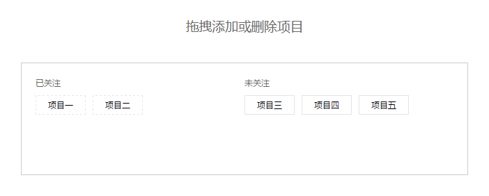

# dragAndChangePosition
### 拖拽添加和删除项目（改变目标的位置）

### 函数调用
  dragItem(box,leftId,rightId);  
  box: 外层包裹的容器的class或Id;  
  leftId: 左侧区域的容器的class或Id;   
  rightId:右侧区域的容器的class或Id;  
  在函数调用的时候，传参数时要把class的'.'或id的'#'加上。  
### 实现效果
  鼠标按下可以任意拖动位置，超出范围的时候在超出的区域增加事件源，未超出范围就不改变位置，函数封装基于jquery。

